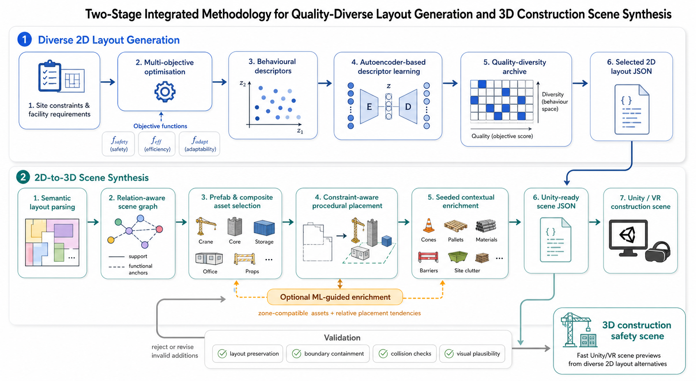

# CEXO-to-Unity

This repository converts construction-site layout JSON files into Unity-ready
3D scene descriptions. It is designed for workflows where many feasible 2D site
layouts are generated by optimisation or quality-diversity search, then quickly
compiled into 3D construction-site scenes for visual inspection, VR prototyping,
or safety-training scene preparation.

The current implementation focuses on the second half of the workflow:

```text
raw 2D layout JSON -> semantic scene graph -> prefab placement
-> scene enrichment -> Unity-ready scene JSON -> Unity preview
```

The upstream layout-generation stage can live in a separate optimisation
project. This repo provides wrappers so the two stages can be run separately or
as one integrated pipeline.



## Methodology

The project is organised as a two-stage integrated methodology.

### 1. Quality-diverse 2D layout generation

The first stage generates diverse construction-site layouts. In manuscript
terms, this stage can be described using established optimisation concepts:

- site constraints and facility requirements
- multi-objective optimisation, such as safety, efficiency, and adaptability
- behavioural descriptors for quality-diversity search
- optional autoencoder-based descriptor learning
- quality-diversity archive of feasible layout alternatives
- selected raw layout JSON files

The raw layout JSON is a planning artefact. It records spatial intent such as
site boundary, entrances, road or exclusion zones, facility labels, positions,
dimensions, rotations, feasibility status, objective scores, and behavioural
descriptor values.

### 2. 2D-to-3D construction scene synthesis

The second stage compiles each raw layout JSON into a Unity-ready scene JSON.
This is the main implemented pipeline in this repository.

The conversion includes:

- raw JSON parsing and geometry reconstruction
- semantic layout parsing for cranes, cores, storage, offices, rest areas,
  roads, entrances, and boundaries
- relation-aware scene graph construction using support and functional anchors
- Unity prefab and composite asset selection
- constraint-aware procedural placement in Unity coordinates
- seeded contextual enrichment with cones, pallets, materials, barriers,
  lights, tools, and other site props
- optional ML-guided accessory selection and relative placement
- validation for layout preservation, boundary containment, overlap checks, and
  visual-review status

The raw layout JSON from Stage 1 is not imported into Unity directly. It is
first compiled into a richer Unity scene JSON containing prefab paths, object
transforms, scales, semantic labels, anchor relations, validation metadata, and
scene-enrichment records.

## What Is Implemented

The current repo includes:

- rule-based layout-to-scene compilation
- semantic prefab catalogue generation from a Unity asset inventory
- curated composite assets for exploded prefab kits such as tower cranes and
  construction cores
- Pair2Scene-inspired support and functional relation records
- seed-controlled scene enrichment while keeping primary layout facilities fixed
- lightweight ML-guided enrichment using trained MLP models
- batch generation from many raw layout JSON files
- a Unity editor importer and scene browser for previewing generated scenes

The ML layer is intentionally auxiliary. The primary layout and major facility
placement remain controlled by the source layout JSON and procedural rules.
The ML models propose zone-compatible secondary assets and relative placement
tendencies, while geometric checks decide what is kept.

## Repository Structure

```text
config/
  asset_catalog.json
  asset_catalog.generated.json
  construction_asset_inventory.csv
  facility_defaults.json

data/
  .gitkeep
  # local raw optimisation layouts go here; large datasets are ignored by git

docs/
  figures/
    methodology_pipeline.png

examples/
  bulleen_layout.json
  standard_layout_021.json

models/
  zone_asset_mlp/
  zone_asset_placement_mlp/
  zone_asset_placement_mlp_accessory/
  scene_realism_mlp/

scripts/
  run_layout_generation.py
  layout_to_scene.py
  batch_generate_unity_scenes.py
  run_full_pipeline.py
  generate_ml_guided_scene.py
  build_asset_catalog.py
  export_ml_dataset.py
  train_*.py
  predict_*.py

unity/
  ConstructionSceneImporter.cs
  Editor/ConstructionSceneBrowserWindow.cs
```

Generated output folders are ignored by git.

## Execution Modes

From the repository root:

```powershell
cd .\scene_pipeline
```

### Mode 1: layout generation only

Use this mode when you want to run or register the upstream 2D layout-generation
stage.

If raw layout JSON files already exist:

```powershell
python .\scripts\run_layout_generation.py --output-dir .\data --safe-only
```

If the optimiser lives in another local project, pass it as a trusted local
command:

```powershell
python .\scripts\run_layout_generation.py --command "python C:\path\to\layout_optimizer.py --output .\data" --output-dir .\data --safe-only
```

This writes:

```text
output/layout_generation/layout_manifest.json
```

The manifest records which compatible raw layout JSON files were found and
summarises their layout IDs, facility counts, objective values, behavioural
descriptors, and feasibility flags.

### Mode 2: layout-to-scene conversion only

Use this mode when raw layout JSON files already exist and you only want to
convert them into Unity-ready scene JSON files.

Single-layout examples:

```powershell
python .\scripts\build_asset_catalog.py
python .\scripts\layout_to_scene.py .\examples\bulleen_layout.json --catalog .\config\asset_catalog.generated.json -o .\output\bulleen_layout_unity_scene.json
python .\scripts\layout_to_scene.py .\examples\standard_layout_021.json --catalog .\config\asset_catalog.generated.json -o .\output\standard_layout_021_unity_scene.json
```

Batch conversion:

```powershell
python .\scripts\batch_generate_unity_scenes.py --input-dir .\data --safe-only --mode ml_guided --seeds 0 --output-root .\output\batch_safe_ml_guided
```

This writes:

```text
output/batch_safe_ml_guided/scenes/
output/batch_safe_ml_guided/batch_report.json
output/batch_safe_ml_guided/scene_records.jsonl
```

For a quick smoke test:

```powershell
python .\scripts\batch_generate_unity_scenes.py --input-dir .\examples --pattern bulleen_layout.json --mode rule --seeds 0 --limit 1 --output-root .\output\smoke_batch
```

### Mode 3: full integrated pipeline

Use this mode when you want one command that runs or registers Stage 1 and then
compiles the resulting raw layouts into Unity-ready scene JSON files.

Using existing raw layout JSONs:

```powershell
python .\scripts\run_full_pipeline.py --layout-output-dir .\data --safe-only --mode ml_guided --seeds 0 --scene-output-root .\output\full_pipeline
```

Running an external layout-generation command first:

```powershell
python .\scripts\run_full_pipeline.py --layout-command "python C:\path\to\layout_optimizer.py --output .\data" --layout-output-dir .\data --safe-only --mode ml_guided --seeds 0 --scene-output-root .\output\full_pipeline
```

This writes:

```text
output/full_pipeline/layout_manifest.json
output/full_pipeline/scenes/
output/full_pipeline/batch_report.json
output/full_pipeline/scene_records.jsonl
output/full_pipeline/full_pipeline_report.json
```

For a small local test:

```powershell
python .\scripts\run_full_pipeline.py --layout-output-dir .\examples --layout-pattern bulleen_layout.json --mode rule --seeds 0 --scene-output-root .\output\smoke_full --limit 1
```

## Scene Enrichment and Visual Variation

The raw layout controls primary facility positions. Scene enrichment adds visual
detail without moving those primary facilities.

Examples of enrichment assets include:

- traffic cones, barrels, and road closures
- pallets, concrete bags, concrete bricks, pipes, planks, rebar, and tarps
- ladders, toolboxes, paint cans, hoses, workbenches, and floodlights
- dirt decals, trash decals, material stacks, and temporary barriers

The scatter seed changes secondary props, local offsets, rotations, and some
compound variants:

```powershell
python .\scripts\layout_to_scene.py .\examples\bulleen_layout.json --scatter-seed 1 -o .\output\bulleen_layout_seed_001_unity_scene.json
python .\scripts\layout_to_scene.py .\examples\bulleen_layout.json --scatter-seed 2 -o .\output\bulleen_layout_seed_002_unity_scene.json
python .\scripts\layout_to_scene.py .\examples\bulleen_layout.json --no-scatter -o .\output\bulleen_layout_no_scatter_unity_scene.json
```

## ML-Guided Enrichment

The ML-guided layer uses small PyTorch MLPs trained from generated scene records.
It is not a full end-to-end scene generator.

Implemented models:

- `zone_asset_mlp`: predicts likely accessory assets from zone specification and
  nearby-zone context
- `zone_asset_placement_mlp_accessory`: predicts relative `x/z/yaw` placement
  for selected accessory assets
- `scene_realism_mlp`: optional classifier for generated-scene review status

Generate one ML-guided scene:

```powershell
python .\scripts\generate_ml_guided_scene.py .\examples\bulleen_layout.json -o .\output\bulleen_layout_ml_guided_unity_scene.json --scatter-seed 0
```

The ML module proposes accessories and placements. Semantic compatibility,
boundary, entrance, exclusion, and overlap checks decide whether each proposal
is retained.

## Unity Preview

The Unity project and HDRP construction-site asset pack are not included in this
repository. To preview generated scenes, copy the Unity scripts into your Unity
project:

```text
unity/ConstructionSceneImporter.cs -> Assets/Scripts/ConstructionSceneImporter.cs
unity/Editor/ConstructionSceneBrowserWindow.cs -> Assets/Editor/ConstructionSceneBrowserWindow.cs
```

Then open Unity and use:

```text
Tools -> CEXO to Unity -> Scene Browser
```

Recommended editor workflow:

1. Click `Browse`.
2. Select a generated scene folder, for example
   `output/batch_safe_ml_guided/scenes`.
3. Select a JSON scene.
4. Click `Import Selected Scene`.

The browser reads JSON files directly from the selected folder. You do not need
to manually copy JSON files into `Assets/StreamingAssets` for editor preview.

Recommended importer settings:

- `Clear Existing Generated Objects`: on
- `Scale To Layout Footprint`: off
- `Create Site Ground`: on
- `Create Road Surfaces`: on
- `Create Boundary Fence`: on
- `Create Entrance Markers`: on
- `Use Prefab Site Context`: on
- `Create Boundary Road Block Clusters`: on
- `Create Entrance Road Blocks`: off
- `Create Footprint Markers`: off
- `Snap Renderer Bounds To Ground`: on

## Validation Outputs

Each generated scene JSON includes a validation report. Batch generation also
writes summary files.

Validation currently covers:

- compatible input JSON detection
- facility/object counts
- boundary containment checks
- overlap checks
- scene status: `pass` or `needs_review`
- ML proposal, retention, acceptance, and rejection counts when `ml_guided`
  mode is used

The current validation supports automated screening and paper reporting, but it
does not replace expert review of construction realism or VR training quality.

## Current Assumptions

- Raw `x` and `y` values are normalised layout coordinates.
- Unity uses `x` and `z` as horizontal axes, with `y` as height.
- Most construction-site objects are ground-supported.
- Primary facility positions come from the raw layout JSON and remain fixed.
- Functional relations are inferred from facility type and nearby context:
  - crane -> nearest core
  - core -> nearest crane or entrance
  - storage -> nearest crane or core
  - office -> nearest entrance
  - rest area -> nearest office or entrance

## Notes for Research Use

For manuscript writing, the safest description is:

> a two-stage integrated pipeline for quality-diverse 2D layout generation and
> Unity-based 3D construction scene synthesis.

The relation graph is rule-inferred and inspired by support/functional scene
representations such as Pair2Scene. The current ML layer is a lightweight
auxiliary enrichment module, not a full graph neural network or end-to-end
generative scene model.

## Suggested Next Steps

1. Add explicit 2D-to-3D layout-preservation metrics.
2. Add more robust oriented bounding-box collision checks.
3. Improve road and entrance connectivity from source layout data.
4. Add more Unity-side screenshot capture for automated visual comparison.
5. Package the workflow into a friendlier demo interface after the research
   methodology stabilises.
