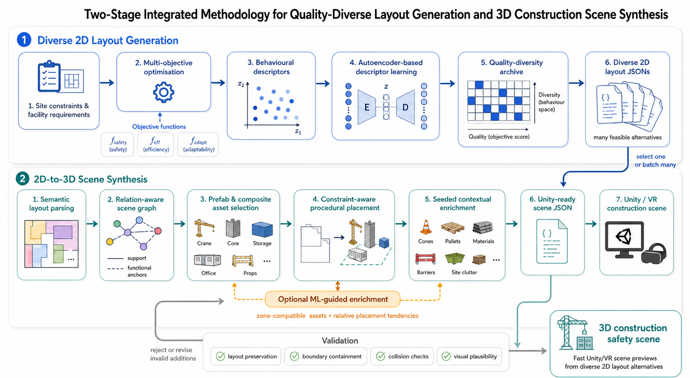
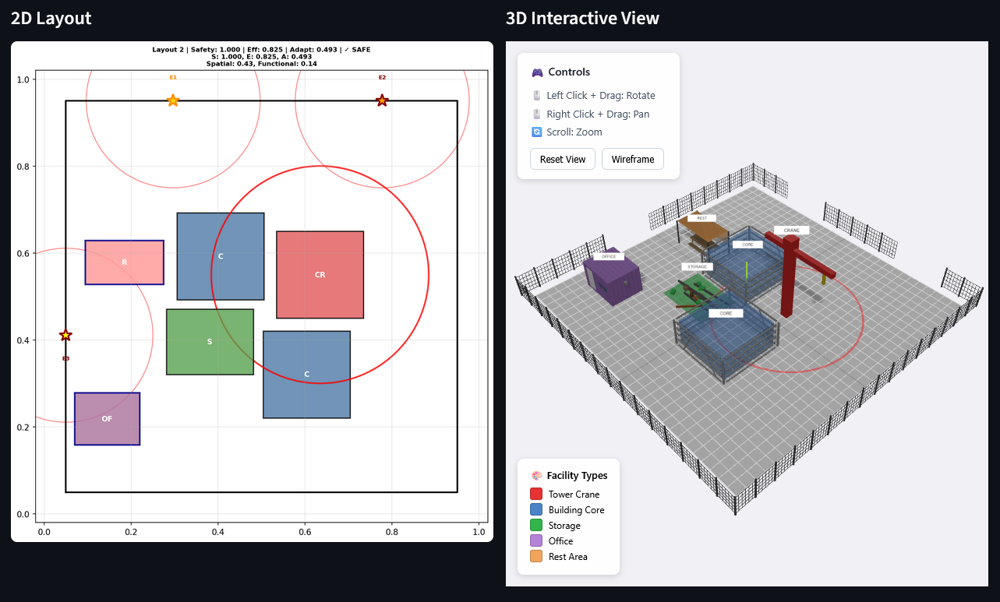
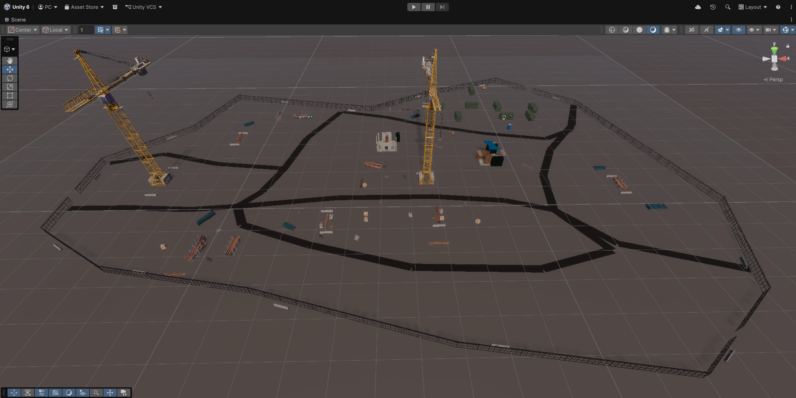

# CEXO-to-Unity


**Automatic Construction-Site Scene Generation Prototype**

## Project Overview

CEXO-to-Unity is a prototype 2D-to-3D construction-site scene generation workflow. It demonstrates how quality-diverse layout optimisation can be connected with Unity-based 3D visualisation to support rapid generation, browsing, and previewing of construction-site layout alternatives.

<p align="center">

</p>

This repository provides:
1. A **web-based Streamlit application** for defining construction-site layout requirements, running CEXO layout generation, and browsing generated layout solutions.
2. A **layout-to-scene conversion pipeline** for transforming CEXO layout JSON outputs into Unity-ready scene JSON files.
3. A **Unity importer package** for loading generated scene JSON files into Unity and visualising them as 3D construction-site scenes.

For detailed information please refer to [CEXO](https://github.com/ClanPing/CEXO.git) repository.

## 🚀 Quick Start

### 1. Clone the repository

```bash
git clone --recursive https://github.com/ClanPing/CEXO-to-Unity.git
cd CEXO-to-Unity
```

### 2. Install dependencies

```bash
pip install -r requirements.txt
```
AND
```bash
cd submodules/cexo
pip install -r requirements.txt
cd ../..
```

### 3. Run the dashboard

```bash
python run_app.py
```

The app will load automatically. If not, load it in the browser manually `http://localhost:8501`.

## 📟 Unity

### 1) Create a Unity project

The Unity importer package was tested with:

```text
Unity Editor: 6000.3.9f1 LTS
Project Template: SRP High Definition 3D
Render Pipeline: HDRP
```

### 2) Import Unity package

Unity package can be found here:

```text
unity/CEXOToUnityImporter.unitypackage
```

### 3) Import assets

Users have two options:

1️⃣ **Use the recommended asset pack**

The generated scenes were developed using the following Unity Asset Store Package. [Construction Site SilverTM](https://assetstore.unity.com/packages/3d/environments/industrial/construction-site-silvertm-154967)

The [Asset Catalog JSON file](unity/StreamingAssets/cexo_asset_catalog.json) included in this repository maps generated construction-site objects to prefab paths from this asset pack.

This repository **does not** contain the paid asset pack.

2️⃣ **Use your own Unity prefabs**

Users may also use their own prefab assets by editing the [Asset Catalogue JSON file](unity/StreamingAssets/cexo_asset_catalog.json) included with the Unity importer.

To use custom assets:

```text
1) Import your prefab assets into the Unity project.
2) Open the asset catalogue JSON file.
3) Replace the default prefab paths with paths to your own prefabs.
4) Open the CEXO Scene Browser in Unity.
5) Select the updated asset catalogue JSON.
6) Import the generated scene JSON.
```

### 4) Usage

```text
Tools > CEXO to Unity > Scene Browser
```

Use `Import Scene JSON...` to load one downloaded scene JSON directly, or use `Generated Scene Folder` to browse a catalogue of `*_unity_scene*.json` files.

## 📊 Preview Results

<p align="center">

</p>

<p align="center">

</p>
